# Tiểu Luận Môn Thiết Kế Web

## tên đề tài:

link:

# HD cài đặt dự án

****Cài đặt Git thông qua link sau:****
[https://git-scm.com/download/win](https://git-scm.com/download/win)

chọn 64-bit Git for Windows Setup.

cài đặt bấm next tất cả.

vào một thư mục chọn để clone dự án về, bằng cách:

chuột phải chọn **git bash here**

đối với win 11 thì:
show more options để hiện **git bash here**

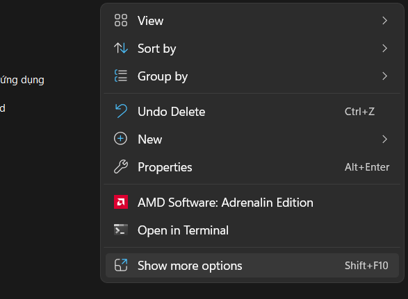

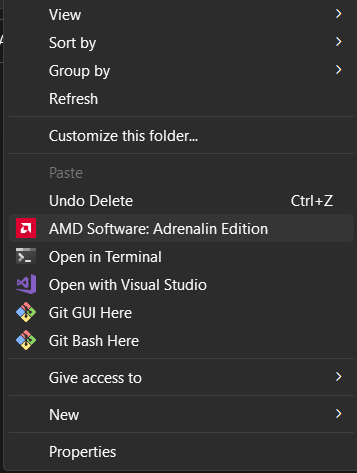

_Nếu không có **git bash here** thì có vẻ cái đặt git chưa thành công_.

---

Mở **git bash here** lên và chạy lệnh sau:

```
git clone https://github.com/CaoNhatLinh/tkweb-project.git
```

nó sẽ tạo ra một thư mục và file chứa sẵn từ github về

sau đó, vào visual studio code để mở dự án lên

file -> add folder to workspace

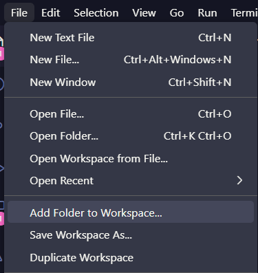

lần đầu tiên chạy dự án đầu tiền , các thành viên trừ nhóm trưởng sẽ phải tạo nhánh dự án bằng cách:

Terminal -> new terminal -> nếu đang mở nhiều dự án khác chọn tên dự án đang làm , ở đây là tkweb-project.

bấm vào dấu mũi lên bên cạnh dấu cộng chọn git bash

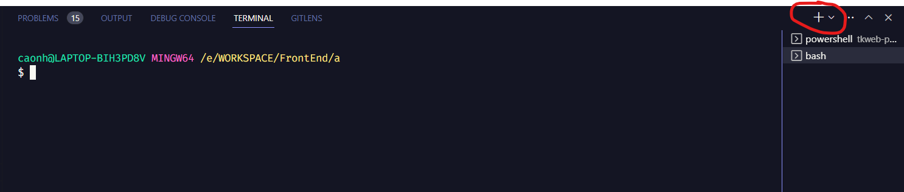

chạy lệnh :

```
git checkout -b tên thanh vien
```

ví dụ:

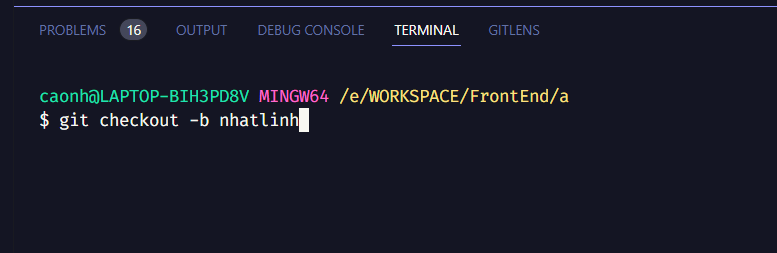

## đã xong giờ bắt đầu làm phần của bạn thân thôi

## Lưu ý

- mỗi lần viết xong hay thay đổi gì muốn dẩy code lên nhớ lưu file lại nhé : ctrl + s.
- Mỗi lần viết code bạn có thể lấy code mới trên local về bằng lệnh:
  ```
  git pull origin main
  ```

mỗi khi làm xong 1 chức nhắn bạn có thể đẩy code lên cho nhóm trưởng bằng các lệnh sau:

lệnh đẩy file lên ở đây dấu chấm có nghĩa là tất cả:
```
git add .
```

thêm mô tả cho lần đẩy code này lên:
`git commit -m "tên phần vừa làm" `

ví dụ :`git commit -m "tạo header"`

lần đẩy code đầu tiên dùng lệnh:
```
git push -u origin tên nhánh 
```
lần đẩy code sau dùng lệnh :
```
git push
```

## ví dụ: ở đây mình có tạo tên nhánh trước đó có tên nhatlinh `git push -u origin nhatlinh `.

sau mỗi lần các bạn đẩy code lên vào github: [https://github.com/CaoNhatLinh/tkweb-project](https://github.com/CaoNhatLinh/tkweb-project)
chọn **pull requests**


chọn **new pull requests**

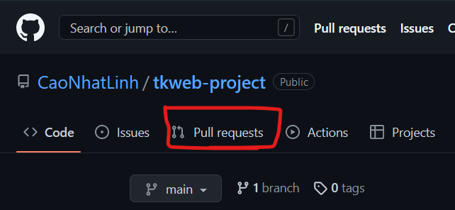

ở phần compare chọn lên nhánh của mình
ví dụ:

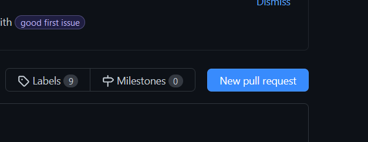

Xong bấm **create pull requests**

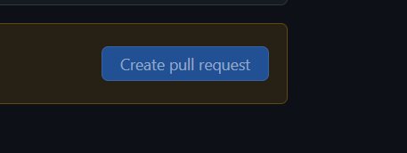

mô tả phần mình làm trước khi bấm vào **create pull requests** ở dưới cùng lần nữa:
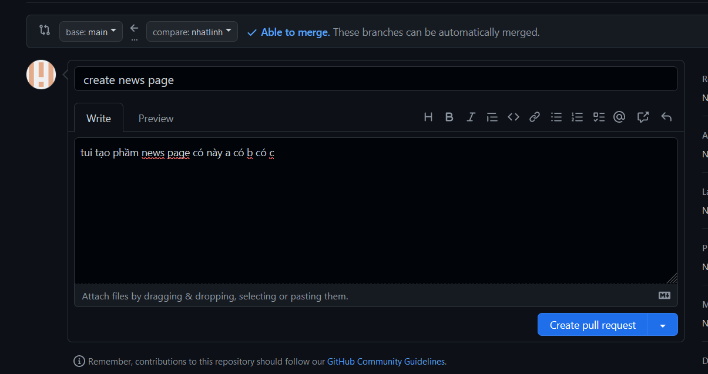

sau khi **create pull requests** xong thì báo lại trưởng nhóm để confirm lên nhanh main

## Hiện tượng conflict khi đẩy code lên :

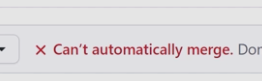

cách fix conflict :

lấy code mới về :
```
git pull origin main
```

nó sẽ báo conflict ở terminal:

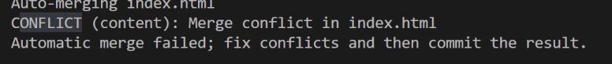

bấm vào biểu tượng như trên hình

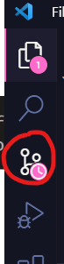

bấm vào file có biểu tượng dấu chấm than

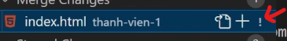

nó sẽ hiện phần bị conflict

trao đổi với người vừa đẩy code lên trước đó xem nên lấy phần nào:

- Accept Current change : lấy theo phần của main(code chính).
- Accept imcoming change : lấy theo phần của mình đã sửa.
- 
  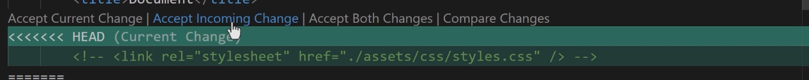

sau khi thay đổi xong lưu file lại:

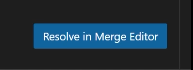

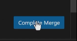

chạy lại các lệnh
```
git pull 
```
```
git add .
```
```
git commit -m "fix conflict ABC" 
```
```
git push
``` 
hoặc 
```
git push -u origin tên nhánh
```

xong báo lại với trưởng nhóm

## Mô tả dự án
